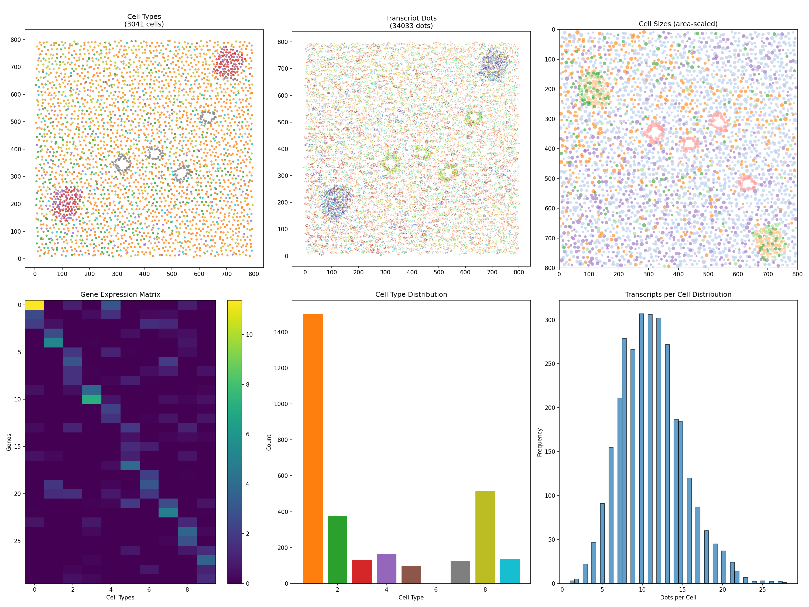

# PointillSim

**Rule-based Simulation Engine for Imaging-based Spatial Transcriptomics**

[](https://github.com/lamanno-epfl/PointillSim/actions/workflows/ci.yml)
[](https://www.python.org/downloads/)



## Overview

PointillSim creates realistic synthetic Fields of View (FOVs) for imaging-based spatial transcriptomics experiments, specifically **HybISS** (Hybridization-based In Situ Sequencing). It generates ground truth cell-type annotations and spatial gene expression data as dots within cells, enabling benchmarking and validation of spatial transcriptomics analysis methods.

## Modeling Philosophy

PointillSim follows a **compositional, rule-based approach** to tissue simulation:

### Hierarchical Composition
Tissues are built from **histological elements**—discrete regions with defined boundaries and cell populations. Elements can represent:
- Background tissue (stroma, parenchyma)
- Specialized structures (glands, vessels, follicles)
- Pathological features (tumors, inflammation foci)

Elements are composed within a **Field of View (FOV)**, where overlapping regions are resolved by priority, allowing foreground structures to "punch through" background tissue.

### Rule-Based Cell Type Assignment
Rather than hardcoding cell type distributions, PointillSim uses **composable rules** that determine how cell types are assigned within each element:

- **Spatial rules**: Create gradients, layers, and distance-based patterns
- **Stochastic rules**: Add biological variability via Dirichlet distributions
- **Composite rules**: Combine multiple strategies with configurable weights

This separation of *where cells are placed* from *what types they become* enables flexible modeling of diverse tissue architectures.

### Probabilistic Observation Model
The simulation pipeline separates **ground truth** from **observed data**:

1. **Ground truth**: Cell positions, type probabilities, expression levels
2. **Observation**: Poisson-sampled transcript counts, spatial dot distributions

This mirrors real experimental variability and enables systematic benchmarking of analysis methods.

## Installation

```bash
# Clone the repository
git clone https://github.com/lamanno-epfl/PointillSim.git
cd PointillSim

# Install in development mode
pip install -e ".[dev]"
```

## Quick Start

```python
from pointillsim import (
    TissueCellTypes, CellTypesProperties, HybISS_Setup,
    FOVDistribution, FrameWideElement, HistologicalElement,
    RandomCellTypeRule, SingleTypeRule, DistanceBasedRule
)

# 1. Define tissue with gene expression profiles
tissue = TissueCellTypes()
tissue.generate_types_and_markers(n_genes=50, n_cell_types=10)

# 2. Create cell type properties (morphology)
cell_props = CellTypesProperties(n_cell_types=10)

# 3. Define FOV distribution with background and foreground elements
bg = lambda: FrameWideElement(frame_size=1000, rules=RandomCellTypeRule(10))
fg = lambda: HistologicalElement(
    scale=150,
    rules=DistanceBasedRule(n_cell_types=10, inner_type=0, outer_type=5)
)
fovd = FOVDistribution(
    frame_size=1000,
    background_element=bg,
    other_elements=[fg],
    elements_frequency=[0.8],
    attempts_at_elements=3
)

# 4. Generate and observe
fov = fovd.generate_fov()
cell_props.apply(fov)

hybiss = HybISS_Setup(tissue)
hybiss.measure_gene_expression(fov)
hybiss.observe_dots(fov)

# 5. Export data
dots_df = hybiss.make_pandas_df()
cells_df = fov.make_pandas_df()
```

## Package Structure

```
pointillsim/
├── core/
│   ├── fov.py            # FOV, FOVDistribution
│   └── tissue.py         # TissueCellTypes, TissueSlice, RegionSpec
├── elements/
│   ├── base.py           # HistologicalElement
│   ├── frame.py          # FrameWideElement, FrameWideUpdater
│   └── structures.py     # VacuolatedStructure
├── rules/
│   ├── base.py           # CellTypeRuleBase, DummyRule
│   ├── random.py         # RandomCellTypeRule, MixOfNCellTypesRule
│   ├── spatial.py        # ProbabilityNodeFieldRule, SingleTypeRule
│   ├── neighbor.py       # DeterministicNeighborAssignment
│   └── composite.py      # DistanceBasedRule, CompositeRule
├── experiment/
│   ├── hybiss.py         # HybISS_Setup
│   ├── properties.py     # CellTypesProperties
│   └── transfer.py       # TransferFunctionBase, AffineNonNegTransfer
├── utils/
│   ├── geometry.py       # chaikin_smooth, smooth_polygon, point generation
│   ├── math.py           # lognormal utilities
│   ├── interpolation.py  # LinearNDInterpolatorExt
│   └── encoding.py       # one_hot_encode_array, unfold_int_matrix
├── viz/
│   └── plotting.py       # plot_fov, plot_expression_matrix
└── io/
    └── dataset.py        # generate_dataset, load_data
```

## Core Components

### Histological Elements

Elements are the building blocks of simulated tissue:

| Element | Description |
|---------|-------------|
| `HistologicalElement` | Base class; generates convex polygonal boundaries with quasi-hexagonal cell grids |
| `FrameWideElement` | Spans the entire FOV; used for background tissue |
| `VacuolatedStructure` | Ring-shaped elements with central holes (glands, vessels) |

### Cell Type Assignment Rules

Rules determine how cell types are distributed within elements:

| Rule | Description |
|------|-------------|
| `RandomCellTypeRule` | Dirichlet-distributed random types per cell |
| `SingleTypeRule` | All cells assigned to one specific type |
| `MixOfNCellTypesRule` | Fixed proportions of specific cell types |
| `ProbabilityNodeFieldRule` | Spatial interpolation from reference points |
| `DistanceBasedRule` | Radial patterns based on distance from center/boundary |
| `CompositeRule` | Weighted combination of multiple rules |
| `DeterministicNeighborAssignment` | Neighbor-based patterns |

### FOV Generation

Two modes of operation:

1. **Stochastic FOV Generation** (current): Each FOV is independently generated with random element placement
2. **Tissue Slice Mode** (via `TissueSlice`): Generate a large tissue section, then extract consistent FOV tiles

### Expression & Observation

| Component | Purpose |
|-----------|---------|
| `TissueCellTypes` | Gene expression profiles (genes × cell types matrix) |
| `CellTypesProperties` | Morphological properties: cell size, anisotropy, RNA concentration |
| `HybISS_Setup` | Poisson observation model with optional transfer functions |

## Data Flow

```
TissueCellTypes                    CellTypesProperties
(gene expression profiles)         (morphology per type)
         ↓                                  ↓
FOVDistribution ─────────────────────────→ FOV
(stochastic element placement)      (centroids + probabilities)
         ↓                                  ↓
HistologicalElement(s)              HybISS_Setup
(polygons + cell grids)             (Poisson sampling)
         ↓                                  ↓
CellTypeRule(s)                     Output DataFrames
(probability assignment)            (cells, dots, ground truth)
```

## Key Features

### Polygon Smoothing
Reduce angular appearance of generated polygons:
```python
from pointillsim import chaikin_smooth, smooth_polygon

# Smooth a shapely polygon
smoothed = smooth_polygon(polygon, iterations=3, preserve_area=True)
```

### FOV Manipulation
```python
# Add realistic noise to positions
fov.add_noise(position_std=2.0, probability_std=0.01)

# Subsample cells (for sparse simulations)
fov.subsample(fraction=0.5)
# or
fov.subsample(n_cells=100)
```

### Load Real Expression Data
```python
# Load expression profiles from CSV
tissue = TissueCellTypes.load_from_csv("expression_matrix.csv")
```

### Visualization
```python
from pointillsim import plot_fov, plot_expression_matrix

# Visualize FOV colored by cell type
fig, ax = plot_fov(fov, color_by="class")

# Visualize expression matrix
fig, ax = plot_expression_matrix(tissue, log_scale=True)
```

## Output Files

When using `generate_dataset()`:

| File | Contents |
|------|----------|
| `cells_FOV*.csv` | Ground truth: positions, types, probabilities, morphology |
| `dots_FOV*.csv` | Ground truth: transcript dot positions with cell assignments |
| `cell_centroids_FOV*.csv` | Observable: cell centroid positions only |
| `dots_FOV*.csv` (data/) | Observable: dot positions and gene identity only |
| `cell_types.csv` | Expression matrix used for simulation |

## Roadmap

See [TODO.md](TODO.md) for the full development roadmap. Key planned features:

- **New Histological Elements**: LinearLumenStructure, LayeredElement, BranchingStructure
- **Additional Rules**: LayerRule, GradientRule
- **Batch Effects**: Technical variation modeling
- **Covariates**: Control simulation parameters systematically
- **AnnData Integration**: Load/export to AnnData format
- **Difficulty Scoring**: Estimate classification difficulty of simulated data

## Dependencies

- **NumPy/SciPy** - Numerical computation and interpolation
- **Pandas** - Data handling and export
- **Shapely** - Geometric operations (polygons, containment)
- **scikit-learn** - Spatial queries (KDTree)
- **Matplotlib** - Visualization
- **TQDM** - Progress bars

## Contributing

Contributions are welcome! Please see [TODO.md](TODO.md) for areas where help is needed.

## License

MIT License - see LICENSE file for details.
